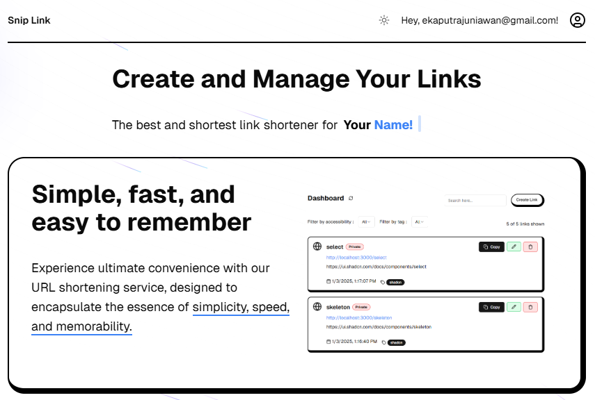

<a href="https://snip-link-five.vercel.app/">
  
  <h1>Snip Link</h1>
</a>

<p>
 Snip Link is a web-based application designed to simplify link shortening. With a simple, responsive, and intuitive interface, Snip Link allows users to transform long URLs into short, memorable links that are easy to share. Additionally, the platform includes security features to protect your links, ensuring a fast and reliable user experience.
</p>

## Features

- Works across the entire [Next.js](https://nextjs.org) stack
  - App Router
  - Pages Router
  - Middleware
  - Client
  - Server
  - It just works!
- supabase-ssr. A package to configure Supabase Auth to use cookies
- Styling with [Tailwind CSS](https://tailwindcss.com)
- Components with [shadcn/ui](https://ui.shadcn.com/) & [acternity/ui](https://ui.aceternity.com/)

## Demo

You can view a fully working demo at [snip-link-five.vercel.app](https://snip-link-five.vercel.app/).

## Clone and run locally

1. You'll first need a Supabase project which can be made [via the Supabase dashboard](https://database.new)

2. Create a Next.js app using the Supabase Starter template npx command

   ```bash
   npx create-next-app -e with-supabase
   ```

3. Use `cd` to change into the app's directory

   ```bash
   cd name-of-new-app
   ```

4. Rename `.env.example` to `.env.local` and update the following:

   ```
   NEXT_PUBLIC_SUPABASE_URL=[INSERT SUPABASE PROJECT URL]
   NEXT_PUBLIC_SUPABASE_ANON_KEY=[INSERT SUPABASE PROJECT API ANON KEY]
   ```

   Both `NEXT_PUBLIC_SUPABASE_URL` and `NEXT_PUBLIC_SUPABASE_ANON_KEY` can be found in [your Supabase project's API settings](https://app.supabase.com/project/_/settings/api)

5. You can now run the Next.js local development server:

   ```bash
   npm run dev
   ```

   The starter kit should now be running on [localhost:3000](http://localhost:3000/).

6. This template comes with the default shadcn/ui style initialized. If you instead want other ui.shadcn styles, delete `components.json` and [re-install shadcn/ui](https://ui.shadcn.com/docs/installation/next)

> Check out [the docs for Local Development](https://supabase.com/docs/guides/getting-started/local-development) to also run Supabase locally.

## Thankyou
